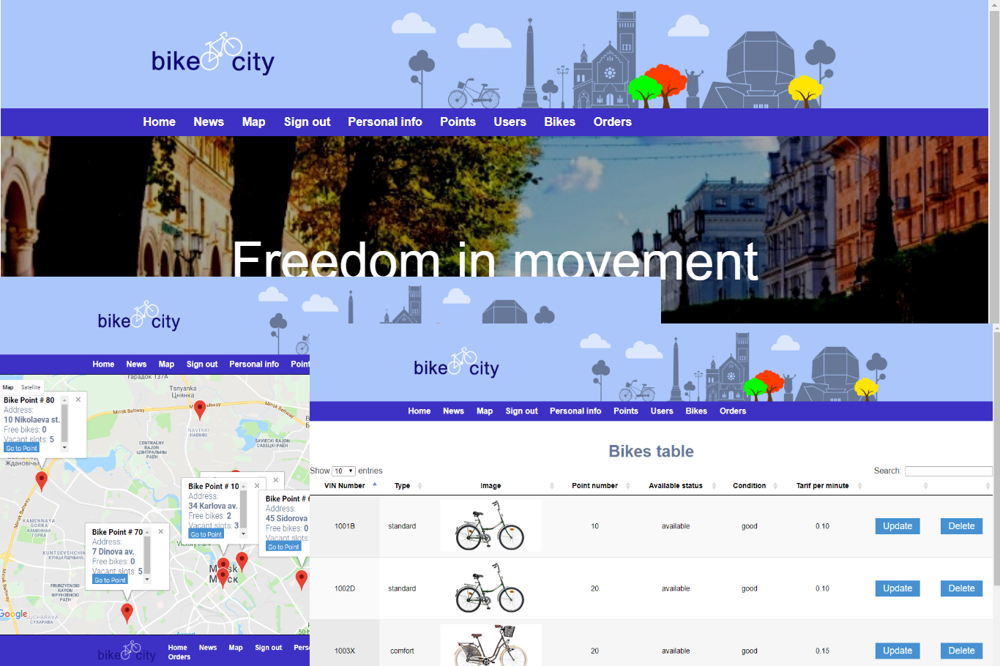

Bike Rent
=========
 Automatic Bicycle Rent For City 

To use one of the many bikes on bike stations of the city, the customer needs to register on the site, which lists personal data (name, passport number, credit card number, etc.). The site can also be viewed online information about the number of bikes in parking lots. To use the rental service, you need to have a balance of bank card not less than 100$.

Conditions:

1 - the funds will be blocked on the client's account since the beginning of the rental,

2 - in case of timely return bike to any rent station, blocked funds will be available again to the client, while part of the funds may be subject to write-off according to the rates for services. 

[](https://github.com/babroval/bike-rent/blob/master/LICENSE)
```
	@RequestMapping(value = { "/order-{numPoint}" }, method = RequestMethod.GET)
	public String order(@PathVariable Integer numPoint, ModelMap model) {
		Point point = pointService.getPointByNum(numPoint);
		model.addAttribute("point", point);
		Integer vacant = point.getSlots() - point.getFreeBikes();
		if (vacant < 0) {
			vacant = 0;
		}
		List<String> vacantSlots = new ArrayList<String>();
		for (int i = 0; i < vacant; i++) {
			vacantSlots.add("VACANT SLOT");
		}
		model.addAttribute("vacantSlots", vacantSlots);
		List<Bike> bikes = bikeService.getBikesByPoint(numPoint);
		model.addAttribute("bikes", bikes);
		String login = (String) session.getAttribute("loggedUser");
		Order prossesingOrder = orderService.getProssesingOrderByLogin(login);
		if (prossesingOrder == null) {
			Order order = new Order();
			model.addAttribute("order", order);
			return "order";
		}
		model.addAttribute("order", prossesingOrder);
		return "order";
	}
	@RequestMapping(value = { "/order-{numPoint}" }, method = RequestMethod.POST)
	public String order(Order order, @PathVariable Integer numPoint,
						BindingResult result, ModelMap model) {
		if (order.getId() == null) {
			String login = (String) session.getAttribute("loggedUser");
			orderService.openOrder(order, numPoint, login);
			Order prossesingOrder = orderService.getProssesingOrderByLogin(login);
			model.addAttribute("success", "Your order \"" 
				  + prossesingOrder.getId() 
				  + "\" confirmed successfully.");
			return "orderSuccess";
		}
		orderService.closeOrder(order, numPoint);
		Order completeOrder = orderService.getOrderById(order.getId());
		model.addAttribute("success", "Your order \"" 
						  + completeOrder.getId() + "\" completed successfully."
						  + " Total cost is " + completeOrder.getTotalCost());
		return "orderSuccess";
	}
```

Table of Contents
-----------------
  * [Requirements](#requirements)
  * [Usage](#usage)
  * [Contributing](#contributing)
  * [License](#license)  


Requirements
------------
Bike Rent requires the following to run:
  * [JRE][jre] 8
  * [Apache Tomcat Server][tomcat] 
  * [MySQL Community Server][mysql]  


Usage
-----
Bike Rent is easiest to use with [Eclipse IDE][eclipse]:  
File -> Import -> Git -> Projects From Git > URI


Contributing
------------
To contribute to Bike Rent, clone this repo locally and  
commit your code on a separate branch.
<br/>
<br/>

License
-------
Bike Rent is licensed under the [MIT][mit] license.  

[jre]: http://www.oracle.com/technetwork/java/javase/downloads/
[tomcat]: https://tomcat.apache.org/download-90.cgi
[mysql]: https://dev.mysql.com/downloads/mysql/
[eclipse]: https://www.eclipse.org/downloads/
[mit]: https://github.com/babroval/bike-rent/blob/master/LICENSE/